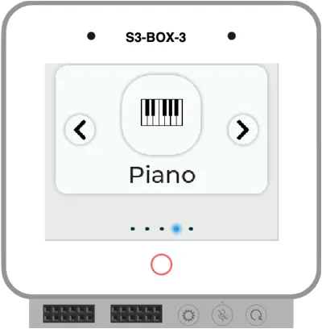

# ESP32 Graphical Bootloader

3rd stage graphical bootloader which lets you pick applications stored in OTA partitions.

[](https://wokwi.com/experimental/viewer?diagram=https://gist.githubusercontent.com/urish/c3d58ddaa0817465605ecad5dc171396/raw/ab1abfa902835a9503d412d55a97ee2b7e0a6b96/diagram.json&firmware=https://github.com/georgik/esp32-graphical-bootloader/releases/latest/download/graphical-bootloader-esp32-s3-box.uf2
)

[Run on-line in Wokwi Simulator](https://wokwi.com/experimental/viewer?diagram=https://gist.githubusercontent.com/urish/c3d58ddaa0817465605ecad5dc171396/raw/ab1abfa902835a9503d412d55a97ee2b7e0a6b96/diagram.json&firmware=https://github.com/georgik/esp32-graphical-bootloader/releases/latest/download/graphical-bootloader-esp32-s3-box.uf2)

## Selected board

The project is by default configured for ESP32-S3-BOX-3. In case of different board please run one of following exports and then CMake command:

- ESP32-S3-BOX-3
```shell
idf.py @boards/esp-box-3.cfg reconfigure
```

- ESP32-S3-BOX (prior Dec. 2023)
```shell
idf.py @boards/esp-box.cfg reconfigure
```

- ESP32-P4
```shell
idf.py @boards/esp32_p4_function_ev_board.cfg reconfigure
```

- M5Stack-CoreS3
```shell
idf.py @boards/m5stack_core_s3.cfg reconfigure
```

## Quick start

Build and flash all applications at once:

```shell
cmake -DBUILD_BOARD=esp-box -Daction=build_all_apps -P Bootloader.cmake
```

## Build applications one by one

```shell
idf.py build flash
pushd apps/tic_tac_toe
idf.py build
esptool.py --before default_reset --after hard_reset write_flash 0x220000 build/tic_tac_toe.bin
popd
pushd apps/wifi_list
esptool.py --before default_reset --after hard_reset write_flash 0x4E0000 build/wifi_list.bin
popd
pushd apps/calculator
esptool.py --before default_reset --after hard_reset write_flash 0x7A0000 build/calculator.bin
popd
pushd apps/synth_piano
esptool.py --before default_reset --after hard_reset write_flash 0xA60000 build/synth_piano.bin
popd
pushd apps/game_of_life
esptool.py --before default_reset --after hard_reset write_flash 0xD20000 build/game_of_life.bin
popd
```

### Merging all applications

The following command merges all applications into UF2 format:

```shell
esptool.py --chip esp32s3 merge_bin --format uf2 -o build/uf2.bin --flash_mode dio --flash_size 16MB \
    0x0 build/bootloader/bootloader.bin \
    0x8000 build/partition_table/partition-table.bin \
    0xf000 build/ota_data_initial.bin \
    0x20000 build/esp32-graphical-bootloader.bin \
    0x220000 apps/tic_tac_toe/build/tic_tac_toe.bin \
    0x4E0000 apps/wifi_list/build/wifi_list.bin \
    0x7A0000 apps/calculator/build/calculator.bin \
    0xA60000 apps/synth_piano/build/synth_piano.bin \
    0xD20000 apps/game_of_life/build/game_of_life.bin
```

The following command merges all applications into binary image format:
```shell
esptool.py --chip esp32s3 merge_bin  -o build.esp-box/combined.bin --flash_mode dio --flash_size 16MB \
    0x0 build.esp-box/bootloader/bootloader.bin \
    0x8000 build.esp-box/partition_table/partition-table.bin \
    0xf000 build.esp-box/ota_data_initial.bin \
    0x20000 build.esp-box/esp32-graphical-bootloader.bin \
    0x220000 apps/tic_tac_toe/build.esp-box/tic_tac_toe.bin \
    0x4E0000 apps/wifi_list/build.esp-box/wifi_list.bin \
    0x7A0000 apps/calculator/build.esp-box/calculator.bin \
    0xA60000 apps/synth_piano/build.esp-box/synth_piano.bin \
    0xD20000 apps/game_of_life/build.esp-box/game_of_life.bin
```

The single binary can be flashed by command:

```shell
esptool.py --chip esp32s3  --baud 921600 write_flash 0x0000 build.esp-box/combined.bin
```

## Build

Initial build and flash of the application and partition table.

```shell
idf.py @boards/esp-box-3.cfg build flash monitor
```

After the initial flash, it's possible to use following command, just to update the factory application:

```shell
idf.py @boards/esp-box-3.cfg app-flash monitor
```

## Flashing apps

Applications are stored in ota_0 - ota_4.

Build application (e.g. hello_world):
```shell
idf.py build
```

Flash applications to ota_0 using [espflash](https://github.com/esp-rs/espflash/blob/main/espflash/README.md#installation):
```
espflash write-bin 0xD20000 .\build\app.bin
```

Alternatively using `esptool.py`:
```
esptool.py --chip esp32s3  --baud 921600 --before default_reset --after hard_reset write_flash 0xD20000 build/hello_world.bin
```

Change offset for other apps:
- ota_0 - 0x220000
- ota_1 - 0x4E0000
- ota_2 - 0x7A0000
- ota_3 - 0xA60000
- ota_4 - 0xD20000

## Updating apps to fallback to bootloader

The bootloader is using OTA mechanism. It's necessary to add following code to the application
in order to reboot to bootloader.

Put the following code to main, before starting the rest of the application:
```c
#include "esp_ota_ops.h"

const esp_partition_t* factory_partition = esp_partition_find_first(ESP_PARTITION_TYPE_APP, ESP_PARTITION_SUBTYPE_APP_FACTORY, NULL);
if (factory_partition != NULL) {
    esp_ota_set_boot_partition(factory_partition);
}
```

Here's more elaborate version which can be put somwhere into application, like reaction on back button:

```c
#include "esp_ota_ops.h"

// Get the partition structure for the factory partition
const esp_partition_t *factory_partition = esp_partition_find_first(ESP_PARTITION_TYPE_APP, ESP_PARTITION_SUBTYPE_APP_FACTORY, NULL);
if (factory_partition != NULL) {
    if (esp_ota_set_boot_partition(factory_partition) == ESP_OK) {
        printf("Set boot partition to factory.\n");
    } else {
        printf("Failed to set boot partition to factory.\n");
    }
} else {
    printf("Factory partition not found.\n");
}

fflush(stdout);
printf("Restarting now.\n");
esp_restart();
```

If the project is using explicit list of components, you need to add `app_update` into `main/CMakeLists.txt`, so it looks like this:
```
idf_component_register(
    SRCS "main.cpp"
    INCLUDE_DIRS "."
    REQUIRES app_update
)
```
