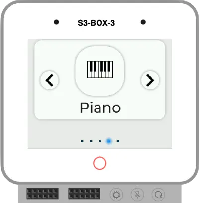

# ESP32 Graphical Bootloader

Third-stage graphical bootloader which allows selecting applications stored in OTA partitions.

## Update 2026-01-04

If you are looking for the newer generation of this application which does not require modification of each binary, see: https://github.com/georgik/esp32-p4-graphical-bootloader

## How it works

The bootloader displays a graphical menu that allows users to select an application from the available OTA partitions. When a selection is made, the system boots into the chosen application. Each application includes code that automatically switches the boot partition back to the bootloader on startup, ensuring the graphical menu is always available on subsequent reboots.

## Requirements

- ESP-IDF v5.5 or later
- ESP BSP selector component (automatically installed via component manager)
- LVGL 9.x (automatically installed via component manager)

### Test on-line

[](https://wokwi.com/experimental/viewer?diagram=https://gist.githubusercontent.com/urish/c3d58ddaa0817465605ecad5dc171396/raw/ab1abfa902835a9503d412d55a97ee2b7e0a6b96/diagram.json&firmware=https://github.com/georgik/esp32-graphical-bootloader/releases/latest/download/graphical-bootloader-esp32-s3-box.uf2
)

[Run on-line in Wokwi Simulator](https://wokwi.com/experimental/viewer?diagram=https://gist.githubusercontent.com/urish/c3d58ddaa0817465605ecad5dc171396/raw/ab1abfa902835a9503d412d55a97ee2b7e0a6b96/diagram.json&firmware=https://github.com/georgik/esp32-graphical-bootloader/releases/latest/download/graphical-bootloader-esp32-s3-box.uf2)

## Supported boards

The project uses the ESP BSP selector component for board configuration. The default board is ESP32-S3-BOX-3.

To select a different board, use the menuconfig interface:

```shell
idf.py menuconfig
```

Navigate to `BSP Selector` -> `Select BSP` and choose your board.

Available boards:
- ESP32-S3-BOX-3 (default)
- ESP32-S3-BOX (prior Dec. 2023)
- ESP32-P4 Function EV Board
- M5Stack-CoreS3
- And other boards supported by ESP BSP

Alternatively, you can set the board in your `sdkconfig` file:

```shell
# For ESP32-S3-BOX-3
CONFIG_BSP_SELECT_ESP_BOX_3=y

# For ESP32-S3-BOX
CONFIG_BSP_SELECT_ESP_BOX=y

# For ESP32-P4
CONFIG_BSP_SELECT_ESP32_P4_FUNCTION_EV_BOARD=y

# For M5Stack-CoreS3
CONFIG_BSP_SELECT_M5STACK_CORE_S3=y
```

## Quick start

Build and flash the bootloader:

```shell
idf.py build flash
```

The bootloader will start and display the menu. To have applications available to select, you need to build and flash them separately (see below).

## Build bootloader and applications

### Build bootloader only

```shell
idf.py build
idf.py flash
```

### Applications storage

Applications are stored in OTA partitions with the following offsets:
- ota_0 - 0x220000
- ota_1 - 0x4E0000
- ota_2 - 0x7A0000
- ota_3 - 0xA60000
- ota_4 - 0xD20000

### Build applications one by one

Commands to build and flash applications:

```shell
# Build and flash bootloader
idf.py build flash

# Build and flash Tic-Tac-Toe
pushd apps/tic_tac_toe
idf.py build
esptool.py --before default_reset --after hard_reset write_flash 0x220000 build/tic_tac_toe.bin
popd

# Build and flash Wi-Fi List
pushd apps/wifi_list
idf.py build
esptool.py --before default_reset --after hard_reset write_flash 0x4E0000 build/wifi_list.bin
popd

# Build and flash Calculator
pushd apps/calculator
idf.py build
esptool.py --before default_reset --after hard_reset write_flash 0x7A0000 build/calculator.bin
popd

# Build and flash Synth Piano
pushd apps/synth_piano
idf.py build
esptool.py --before default_reset --after hard_reset write_flash 0xA60000 build/synth_piano.bin
popd

# Build and flash Game of Life
pushd apps/game_of_life
idf.py build
esptool.py --before default_reset --after hard_reset write_flash 0xD20000 build/game_of_life.bin
popd
```

Alternatively you can use [espflash](https://github.com/esp-rs/espflash/blob/main/espflash/README.md#installation):

```shell
espflash write-bin 0xD20000 ./build/app.bin
```

### Merge all applications into single binary

The following command merges all applications into a single binary image:

```shell
esptool.py --chip esp32s3 merge_bin -o build/combined.bin --flash_mode dio --flash_size 16MB \
    0x0 build/bootloader/bootloader.bin \
    0x8000 build/partition_table/partition-table.bin \
    0xf000 build/ota_data_initial.bin \
    0x20000 build/esp32-graphical-bootloader.bin \
    0x220000 apps/tic_tac_toe/build/tic_tac_toe.bin \
    0x4E0000 apps/wifi_list/build/wifi_list.bin \
    0x7A0000 apps/calculator/build/calculator.bin \
    0xA60000 apps/synth_piano/build/synth_piano.bin \
    0xD20000 apps/game_of_life/build/game_of_life.bin
```

The combined binary can be flashed with:

```shell
esptool.py --chip esp32s3 --baud 921600 write_flash 0x0000 build/combined.bin
```

## Create custom application

You can use any ESP-IDF application with this bootloader. The only requirement is that the application must include a fallback mechanism to return to the bootloader (factory app).

## Application fallback to bootloader

The bootloader uses the OTA mechanism. Applications must include code to return to the bootloader.

### Basic fallback

Add the following code at the beginning of your application's main function:

```c
#include "esp_ota_ops.h"

const esp_partition_t* factory_partition = esp_partition_find_first(ESP_PARTITION_TYPE_APP, ESP_PARTITION_SUBTYPE_APP_FACTORY, NULL);
if (factory_partition != NULL) {
    esp_ota_set_boot_partition(factory_partition);
}
```

### Advanced fallback with button trigger

This example shows how to return to the bootloader when a back button is pressed:

```c
#include "esp_ota_ops.h"
#include "esp_system.h"

void return_to_bootloader(void) {
    // Get the partition structure for the factory partition
    const esp_partition_t *factory_partition = esp_partition_find_first(ESP_PARTITION_TYPE_APP, ESP_PARTITION_SUBTYPE_APP_FACTORY, NULL);
    if (factory_partition != NULL) {
        if (esp_ota_set_boot_partition(factory_partition) == ESP_OK) {
            printf("Set boot partition to factory.\n");
        } else {
            printf("Failed to set boot partition to factory.\n");
        }
    } else {
        printf("Factory partition not found.\n");
    }

    fflush(stdout);
    printf("Restarting now.\n");
    esp_restart();
}
```

### Component dependencies

If your project uses an explicit list of components in `main/CMakeLists.txt`, add the `app_update` component:

```cmake
idf_component_register(
    SRCS "main.cpp"
    INCLUDE_DIRS "."
    REQUIRES app_update
)
```
